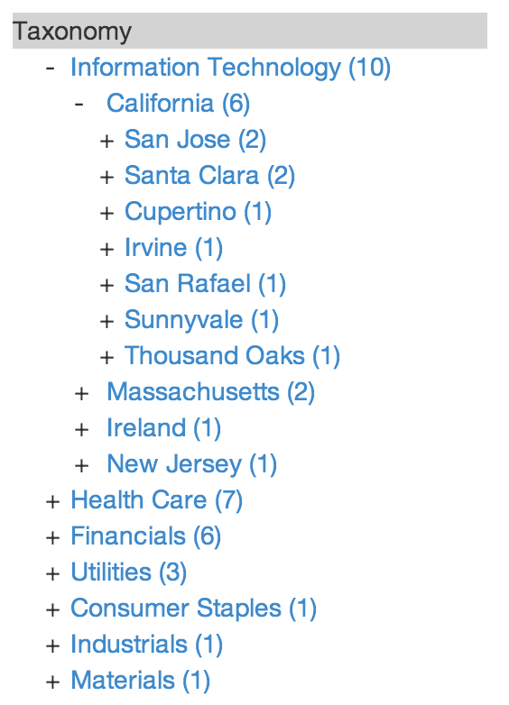

Easy Hierarchical Faceting with Solr
==================

Visiting two major clients in two days last week, each presented me with the same question: how do we better leverage hierarchical information like taxonomies, file paths, etc.
in <a href="http://www.lucidworks.com/download">LucidWorks Search (LWS)</a> (and Apache Solr) their applications, such that they could display something like the following image in their UI:

  Since this is pretty straight forward (much of it is captured already
 on the <a href="http://wiki.apache.org/solr/HierarchicalFaceting">Solr Wiki</a>) and I have both
the client-side and server side code for this already in a few demos we routinely give here at Lucid, I thought I would write it up as a blog
instead of sending each of them a one-off answer.  I am going to be showing this work in the context of the
<a href="http://www.github.com/lucidworks/lws-financial-demo">LWS Financial Demo</a>, for those who wish to follow along at the code level.  We'll use it
to show a little bit of hierarchical faceting that correlates the industry sector of an S&P 500 company with the state and city of the HQ of that company.

Premise
==================

While Solr, the underpinnings of LucidWorks Search, does not have the "native" notion of hierarchical faceting, it is dead simple to do
using a little known parameter to the out of the box <a href="https://cwiki.apache.org/confluence/display/solr/Faceting">faceting</a> capabilities
named "facet.prefix".  The facet prefix parameter simply filters out any terms in the candidate set of terms that don't include the prefix.  Thus, when indexing
your hierarchical content, you need only split up your hierarchy into individual terms and prepend a known prefix onto them that indicates the depth
of the item.  As an example, let's assume I have the following hierarchies, which can be seen in the sp500List.txt file located in
<a href="https://github.com/LucidWorks/lws-financial-demo/tree/master/data">https://github.com/LucidWorks/lws-financial-demo/tree/master/data</a>:
  /Information Technology/Ireland/Dublin
  /Health Care/California/Santa Clara
  /Information Technology/California/San Jose

To employ the facet prefix trick, at indexing time, I can simply prepend
a depth factor onto each split token, e.g. 0/Information Technology; 1/Ireland; 2/Dublin

Schema-wise, I only then need a string field that accepts multi-valued fields, which I have named "hierarchy" in the setup.py
script.  The indexing step is captured in the index_stocks() method and looks like:

    def index_stocks(solr, stocks, id):
      #Symbol,Company,City,State
      print "Indexing Company Info"
      for symbol in stocks:
          vals = stocks[symbol]
          items = {"id": symbol, "symbol": symbol, "company": vals[1], "industry": vals[2], "city": vals[3],
                   "state": vals[4], "hierarchy": ["1/" + vals[2], "2/" + vals[4], "3/" + vals[3]]} # Start at 1/ for ease integration w/ JS
          add(solr, [items], id, commit=False)

The key part of this code block, of course, is the hierarchy section, where I prefix a depth count onto the front of the attributes.  You will
see later, when we get into the front end code, how this is leveraged by the Javascript.

See the README.md on how to run the setup program.  Note, you will need a Twitter API key if you wish to index the Twitter feeds part of the demo.

Displaying the Hierarchy on the Client
==================

On the client side, we've created a bit of jQuery-based Javascript that interactively displays a hierarchical tree of the facets as well
as handles all of the requests to update the content.  This approach also requires a bit of backend support in the Flask App by way of the
hierarchical_facets() method in python.py, since we are requesting the facet hierarchy information outside of the context of the main request
to LWS when searching.  The key to this method is simply the addition/manipulation of the facet.prefix parameter, which uses the passed in value from the client
to restrict down the facet values.

On the client side, it's all in the Javascript, which can be broken down into a couple of key functions, plus
some Jinja2 templating (which can easily be transformed to whatever your favorite templating engine is, as I have done this
several times in the past) glue.  (Forgive me if this isn't the best Javascript you have seen, I'm definitely not a JS expert!)

The code for all of the client side is in the <a href="https://github.com/LucidWorks/lws-financial-demo/blob/master/src/main/python/templates/facet_hierarchy.jinja2">facet_hierarchy.jinja2</a> file

The first thing to notice is that we have a simple placeholder div tag named "hierarchy", which we are going to attach the taxonomy to in the HTML.
From here, it is probably easiest to work from the end of the file back to the start, as the initial request
to the backend is generated here.  The main thing to notice is the setup of the facet request and the call to jQuery.getJSON(), which
makes the call to the hierarchical_facets() method on the backend:

    the_response = jQuery.getJSON(url, request_data, listCats);

The last parameter, listCats, is the jQuery call back function which is responsible for rendering the tree and is thus, the logical
next step in our tour of the Javascript.  In listCats, we take the response from the backend and create our list of
categories by calling catList() and then render them into the hierarchy with the call:

    jQuery('#hierarchy').before(list).prev()
          .find('.expand').click( toggleCat ).css({cursor:'pointer', display:'inline-block', width:'1em'});

The catList() method is where the actual HTML is produced (yes, I hate embedded HTML in JS, but for the sake our example, it will do).
Note, if you are interested in the CSS side of the equation, check out the <a href="https://github.com/LucidWorks/lws-financial-demo/blob/master/src/main/python/static/css/app.css">app.css</a>
file and the section labeled "facet-hierarchy" for the appropriate CSS settings.

At this point, the last bit of code needed is the functionality to deal with the various clicks (expansions, selection, etc.), which
are sprinkled throughout the code, but primarily focused in the toggleCat() method.

As you can see, it really is quite easy to add hierarchical facets into your search app through a little bit of indexing trickery
and some jQuery smarts.

Next Steps
==================

It wouldn't be code if there wasn't something else we could do here to improve things.  As a next step, I think it would be great
if someone codified all of this a bit more into the appropriate Solr analysis capabilities and request handler, as well as cleaned up
my Flask and Javascript.  Using my favorite phrase from my college math days, I'll leave that as an exercise to the reader.  If you do
take up any of those tasks, feel free to let me know the Solr JIRA issue or to file a Pull Request and I'll see what I can do
to get it integrated.
